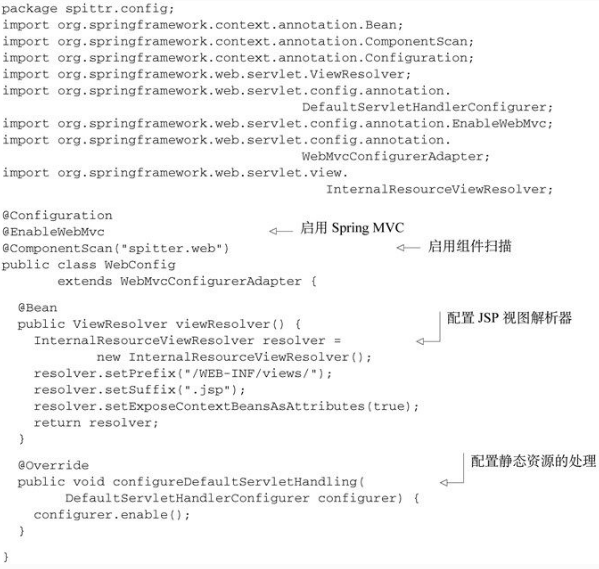

你见到过孩子们的捕鼠器游戏吗？这真是一个疯狂的游戏，它的目标是发送一个小钢球，让它经过一系列稀奇古怪的装置，最后触发捕鼠器。小钢球穿过各种复杂的配件，从一个斜坡上滚下来，被跷跷板弹起，绕过一个微型摩天轮，然后被橡胶靴从桶中踢出去。经过这些后，小钢球会对那只可怜又无辜的橡胶老鼠进行捕获。

乍看上去，你会认为Spring MVC框架与捕鼠器有些类似。Spring将请求在调度Servlet、处理器映射（handler mapping）、控制器以及视图解析器（view resolver）之间移动，而捕鼠器中的钢球则会在各种斜坡、跷跷板以及摩天轮之间滚动。但是，不要将Spring MVC与Rube Goldberg-esque捕鼠器游戏做过多比较。每一个Spring MVC中的组件都有特定的目的，并且它也没有那么复杂。

让我们看一下请求是如何从客户端发起，经过Spring MVC中的组件，最终再返回到客户端的。

## 跟踪Spring MVC的请求

每当用户在Web浏览器中点击链接或提交表单的时候，请求就开始工作了。对请求的工作描述就像是快递投送员。与邮局投递员或FedEx投送员一样，请求会将信息从一个地方带到另一个地方。

请求是一个十分繁忙的家伙。从离开浏览器开始到获取响应返回，它会经历好多站，在每站都会留下一些信息同时也会带上其他信息。图5.1展示了请求使用Spring MVC所经历的所有站点。


在请求离开浏览器时(1)，会带有用户所请求内容的信息，至少会包含请求的URL。但是还可能带有其他的信息，例如用户提交的表单信息。

请求旅程的第一站是Spring的DispatcherServlet。与大多数基于Java的Web框架一样，Spring MVC所有的请求都会通过一个前端控制器（front controller）Servlet。前端控制器是常用的Web应用程序模式，在这里一个单实例的Servlet将请求委托给应用程序的其他组件来执行实际的处理。在Spring MVC中，DispatcherServlet就是前端控制器。

DispatcherServlet的任务是将请求发送给Spring MVC控制器（controller）。控制器是一个用于处理请求的Spring组件。在典型的应用程序中可能会有多个控制器，DispatcherServlet需要知道应该将请求发送给哪个控制器。所以DispatcherServlet以会查询一个或多个处理器映射（handler mapping）(2)来确定请求的下一站在哪里。处理器映射会根据请求所携带的URL信息来进行决策。

一旦选择了合适的控制器，DispatcherServlet会将请求发送给选中的控制器(3)。到了控制器，请求会卸下其负载（用户提交的信息）并耐心等待控制器处理这些信息。（实际上，设计良好的控制器本身只处理很少甚至不处理工作，而是将业务逻辑委托给一个或多个服务对象进行处理。）

控制器在完成逻辑处理后，通常会产生一些信息，这些信息需要返回给用户并在浏览器上显示。这些信息被称为模型（model）。不过仅仅给用户返回原始的信息是不够的——这些信息需要以用户友好的方式进行格式化，一般会是HTML。所以，信息需要发送给一个视图（view），通常会是JSP。

控制器所做的最后一件事就是将模型数据打包，并且标示出用于渲染输出的视图名。它接下来会将请求连同模型和视图名发送回DispatcherServlet(4)。

这样，控制器就不会与特定的视图相耦合，传递给DispatcherServlet的视图名并不直接表示某个特定的JSP。实际上，它甚至并不能确定视图就是JSP。相反，它仅仅传递了一个逻辑名称，这个名字将会用来查找产生结果的真正视图。DispatcherServlet将会使用视图解析器（view resolver）(5)来将逻辑视图名匹配为一个特定的视图实现，它可能是也可能不是JSP。

既然DispatcherServlet已经知道由哪个视图渲染结果，那请求的任务基本上也就完成了。它的最后一站是视图的实现（可能是JSP）(6)，在这里它交付模型数据。请求的任务就完成了。视图将使用模型数据渲染输出，这个输出会通过响应对象传递给客户端（不会像听上去那样硬编码）(7)。

可以看到，请求要经过很多的步骤，最终才能形成返回给客户端的响应。大多数的步骤都是在Spring框架内部完成的，也就是图5.1所示的组件中。尽管本章的主要内容都关注于如何编写控制器，但在此之前我们首先看一下如何搭建Spring MVC的基础组件。

## 搭建Spring MVC

基于图5.1，看上去我们需要配置很多的组成部分。幸好，借助于最近几个Spring新版本的功能增强，开始使用Spring MVC变得非常简单了。现在，我们要使用最简单的方式来配置Spring MVC：所要实现的功能仅限于运行我们所创建的控制器。在第7章中，我们会看一些其他的配置选项。

配置DispatcherServlet
DispatcherServlet是Spring MVC的核心。在这里请求会第一次接触到框架，它要负责将请求路由到其他的组件之中。

按照传统的方式，像DispatcherServlet这样的Servlet会配置在web.xml文件中，这个文件会放到应用的WAR包里面。当然，这是配置DispatcherServlet的方法之一。但是，借助于Servlet 3规范和Spring 3.1的功能增强，这种方式已经不是唯一的方案了，这也不是我们本章所使用的配置方法。

我们会使用Java将DispatcherServlet配置在Servlet容器中，而不会再使用web.xml文件。如下的程序清单展示了所需的Java类。

程序清单5.1　配置DispatcherServlet


在我们深入介绍程序清单5.1之前，你可能想知道spittr到底是什么意思。这个类的名字是SpittrWebAppInitializer，它位于名为spittr.config的包中。我稍后会对其进行介绍（在5.1.3小节中），但现在，你只需要知道我们所要创建的应用名为Spittr。

要理解程序清单5.1是如何工作的，我们可能只需要知道扩展AbstractAnnotation-ConfigDispatcherServletInitializer的任意类都会自动地配置Dispatcher-Servlet和Spring应用上下文，Spring的应用上下文会位于应用程序的Servlet上下文之中。

### AbstractAnnotationConfigDispatcherServletInitializer剖析

如果你坚持要了解更多细节的话，那就看这里吧。在Servlet 3.0环境中，容器会在类路径中查找实现javax.servlet.ServletContainerInitializer接口的类，如果能发现的话，就会用它来配置Servlet容器。

Spring提供了这个接口的实现，名为SpringServletContainerInitializer，这个类反过来又会查找实现WebApplicationInitializer的类并将配置的任务交给它们来完成。Spring 3.2引入了一个便利的WebApplicationInitializer基础实现，也就是AbstractAnnotationConfigDispatcherServletInitializer。因为我们的Spittr-WebAppInitializer扩展了AbstractAnnotationConfig DispatcherServlet-Initializer（同时也就实现了WebApplicationInitializer），因此当部署到Servlet 3.0容器中的时候，容器会自动发现它，并用它来配置Servlet上下文。

尽管它的名字很长，但是AbstractAnnotationConfigDispatcherServlet-Initializer使用起来很简便。在程序清单5.1中，SpittrWebAppInitializer重写了三个方法。

第一个方法是getServletMappings()，它会将一个或多个路径映射到DispatcherServlet上。在本例中，它映射的是“/”，这表示它会是应用的默认Servlet。它会处理进入应用的所有请求。

为了理解其他的两个方法，我们首先要理解DispatcherServlet和一个Servlet监听器（也就是ContextLoaderListener）的关系。

### 两个应用上下文之间的故事

当DispatcherServlet启动的时候，它会创建Spring应用上下文，并加载配置文件或配置类中所声明的bean。在程序清单5.1的getServletConfigClasses()方法中，我们要求DispatcherServlet加载应用上下文时，使用定义在WebConfig配置类（使用Java配置）中的bean。

但是在Spring Web应用中，通常还会有另外一个应用上下文。另外的这个应用上下文是由ContextLoaderListener创建的。

我们希望DispatcherServlet加载包含Web组件的bean，如控制器、视图解析器以及处理器映射，而ContextLoaderListener要加载应用中的其他bean。这些bean通常是驱动应用后端的中间层和数据层组件。

实际上，AbstractAnnotationConfigDispatcherServletInitializer会同时创建DispatcherServlet和ContextLoaderListener。GetServlet-ConfigClasses()方法返回的带有@Configuration注解的类将会用来定义DispatcherServlet应用上下文中的bean。getRootConfigClasses()方法返回的带有@Configuration注解的类将会用来配置ContextLoaderListener创建的应用上下文中的bean。

在本例中，根配置定义在RootConfig中，DispatcherServlet的配置声明在WebConfig中。稍后我们将会看到这两个类的内容。

需要注意的是，通过AbstractAnnotationConfigDispatcherServlet-Initializer来配置DispatcherServlet是传统web.xml方式的替代方案。如果你愿意的话，可以同时包含web.xml和AbstractAnnotationConfigDispatcher-ServletInitializer，但这其实并没有必要。

如果按照这种方式配置DispatcherServlet，而不是使用web.xml的话，那唯一问题在于它只能部署到支持Servlet 3.0的服务器中才能正常工作，如Tomcat 7或更高版本。Servlet 3.0规范在2009年12月份就发布了，因此很有可能你会将应用部署到支持Servlet 3.0的Servlet容器之中。

如果你还没有使用支持Servlet 3.0的服务器，那么在AbstractAnnotation-ConfigDispatcherServletInitializer子类中配置DispatcherServlet的方法就不适合你了。你别无选择，只能使用web.xml了。我们将会在第7章学习web.xml和其他配置选项。但现在，我们先看一下程序清单5.1中所引用的WebConfig和RootConfig，了解一下如何启用Spring MVC。

### 启用Spring MVC

我们有多种方式来配置DispatcherServlet，与之类似，启用Spring MVC组件的方法也不仅一种。以前，Spring是使用XML进行配置的，你可以使用**`<mvc:annotation-driven>`**启用注解驱动的Spring MVC。

我们会在第7章讨论Spring MVC配置可选项的时候，再讨论**`<mvc:annotation-driven>`**。不过，现在我们会让Spring MVC的搭建过程尽可能简单并基于Java进行配置。

我们所能创建的最简单的Spring MVC配置就是一个带有@EnableWebMvc注解的类：

```java
package spittr.config;
import org.springframework.context.annotation.Configuration;
import org.springframework.web.servlet.config.annotation.EnableWebMvc;

@Configuration
@EnableWebMvc
public class WebConfig {
}
```

这可以运行起来，它的确能够启用Spring MVC，但还有不少问题要解决：

- 没有配置视图解析器。如果这样的话，Spring默认会使用BeanNameView-Resolver，这个视图解析器会查找ID与视图名称匹配的bean，并且查找的bean要实现View接口，它以这样的方式来解析视图。
- 没有启用组件扫描。这样的结果就是，Spring只能找到显式声明在配置类中的控制器。
- 这样配置的话，DispatcherServlet会映射为应用的默认Servlet，所以它会处理所有的请求，包括对静态资源的请求，如图片和样式表（在大多数情况下，这可能并不是你想要的效果）。
因此，我们需要在WebConfig这个最小的Spring MVC配置上再加一些内容，从而让它变得真正有用。如下程序清单中的WebConfig解决了上面所述的问题。

程序清单5.2　最小但可用的Spring MVC配置



在程序清单5.2中第一件需要注意的事情是WebConfig现在添加了@Component-Scan注解，因此将会扫描spitter.web包来查找组件。稍后你就会看到，我们所编写的控制器将会带有@Controller注解，这会使其成为组件扫描时的候选bean。因此，我们不需要在配置类中显式声明任何的控制器。

接下来，我们添加了一个ViewResolver bean。更具体来讲，是Internal-ResourceViewResolver。我们将会在第6章更为详细地讨论视图解析器。我们只需要知道它会查找JSP文件，在查找的时候，它会在视图名称上加一个特定的前缀和后缀（例如，名为home的视图将会解析为/WEB-INF/views/home.jsp）。

最后，新的WebConfig类还扩展了WebMvcConfigurerAdapter并重写了其configureDefaultServletHandling()方法。通过调用DefaultServlet-HandlerConfigurer的enable()方法，我们要求DispatcherServlet将对静态资源的请求转发到Servlet容器中默认的Servlet上，而不是使用DispatcherServlet本身来处理此类请求。

WebConfig已经就绪，那RootConfig呢？因为本章聚焦于Web开发，而Web相关的配置通过DispatcherServlet创建的应用上下文都已经配置好了，因此现在的RootConfig相对很简单：

```java
package spittr.config;

import org.springframework.context.annotation.ComponentScan;
import org.springframework.context.annotation.ComponentScan.Filter;
import org.springframework.context.annotation.Configuration;
import org.springframework.context.annotation.FilterType;
import org.springframework.web.servlet.config.annotation.EnableWebMvc;

@Configuration
@ComponentScan(basePackages={"spitter"},
    excludeFilters={
        @Filter(type=FilterType.ANNOTATION, value=EnableWebMvc.class)
    })
public class RootConfig {
}
```

唯一需要注意的是RootConfig使用了@ComponentScan注解。这样的话，在本书中，我们就有很多机会用非Web的组件来充实完善RootConfig。

现在，我们基本上已经可以开始使用Spring MVC构建Web应用了。此时，最大的问题在于，我们要构建的应用到底是什么。