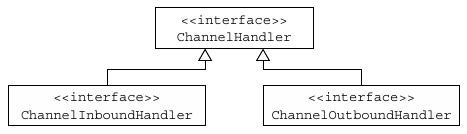
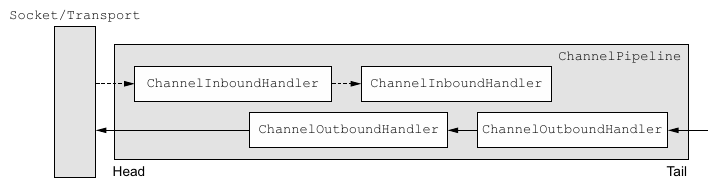

让我们从框架的视角来探讨Netty。从高层次的角度来看，Netty解决了两个相应的关注领域，我们可将其大致标记为技术的和体系结构的。首先，它的基于Java NIO的异步的和事件驱动的实现，保证了高负载下应用程序性能的最大化和可伸缩性。其次，Netty也包含了一组设计模式，将应用程序逻辑从网络层解耦，简化了开发过程，同时也最大限度地提高了可测试性、模块化以及代码的可重用性。

在我们更加详细地研究Netty的各个组件时，我们将密切关注它们是如何通过协作来支撑这些体系结构上的最佳实践的。通过遵循同样的原则，我们便可获得Netty所提供的所有益处。牢记这个目标，我们将回顾到目前为止我们介绍过的主要概念和组件。

## Channel、EventLoop和ChannelFuture

接下来的各节将会为我们对于Channel、EventLoop和ChannelFuture类进行的讨论增添更多的细节，这些类合在一起，可以被认为是Netty网络抽象的代表：

- Channel——Socket
- EventLoop——控制流、多线程处理、并发
- ChannelFuture——异步通知

### Channel接口

基本的I/O操作（bind()、connect()、read()和write()）依赖于底层网络传输所提供的**原语**。在基于Java的网络编程中，其基本的构造是**class Socket**。Netty的Channel接口所提供的API，大大地降低了**直接**使用Socket类的复杂性。此外，Channel也是拥有许多预定义的、专门化实现的广泛类层次结构的根，下面是一个简短的部分清单：

- EmbeddedChannel
- LocalServerChannel
- NioDatagramChannel
- NioSctpChannel
- NioSocketChannel

### EventLoop接口

EventLoop定义了Netty的核心抽象，用于处理连接的生命周期中所发生的事件。目前，图3-1在高层次上说明了Channel、EventLoop、Thread以及EventLoopGroup之间的关系。

图3-1　Channel、EventLoop和EventLoopGroup

这些关系是：

- 一个EventLoopGroup包含一个或者多个EventLoop
- 一个EventLoop在它的生命周期内**只和一个Thread**绑定
- 所有由EventLoop处理的I/O事件都将在它专有的Thread上被处理
- 一个Channel在它的生命周期内**只注册**于一个EventLoop
- 一个EventLoop可能会被分配给一个或多个Channel

### ChannelFuture接口

正如我们已经解释过的那样，Netty中所有的I/O操作都是**异步**的。因为一个操作可能不会立即返回，所以我们需要一种用于在之后的某个时间点确定其结果的方法。为此，Netty提供了**`ChannelFuture`**接口，其**`addListener()`**方法注册了一个**`ChannelFutureListener`**，以便在某个操作完成时（无论是否成功）得到通知。

> **关于ChannelFuture的更多讨论**

> 可以将ChannelFuture看作是将来要执行的操作的结果的**占位符**。它究竟什么时候被执行则可能取决于若干的因素，因此不可能准确地预测，但是可以肯定的是它将会被执行。此外，所有属于同一个Channel的操作都被保证其将以它们被调用的顺序被执行。

## ChannelHandler和ChannelPipeline

现在，我们将更加细致地看一看那些**管理数据流**以及**执行应用程序处理逻辑**的组件。

### ChannelHandler接口

从应用程序开发人员的角度来看，Netty的主要组件是**`ChannelHandler`**，它充当了所有处理入站和出站数据的应用程序逻辑的容器。这是可行的，因为**`ChannelHandler`**的方法是由网络事件（其中术语“事件”的使用非常广泛）触发的。事实上，**`ChannelHandler`**可专门用于几乎任何类型的动作，例如将数据从一种格式转换为另外一种格式，或者处理转换过程中所抛出的异常。

举例来说，**`ChannelInboundHandler`**是一个你将会经常实现的子接口。这种类型的**`ChannelHandler`**接收入站事件和数据，这些数据随后将会被你的应用程序的业务逻辑所处理。当你要给连接的客户端发送响应时，也可以从**`ChannelInboundHandler`**冲刷数据。你的应用程序的业务逻辑通常驻留在一个或者多个**`ChannelInboundHandler`**中。

### ChannelPipeline接口

ChannelPipeline为ChannelHandler链提供了容器，并定义了用于在该链上传播入站和出站事件流的API。当Channel被创建时，它会被自动地分配到它专属的ChannelPipeline。

ChannelHandler安装到ChannelPipeline中的过程如下所示：

- 一个ChannelInitializer的实现被注册到了ServerBootstrap（或Bootstrap）中
- 当**`ChannelInitializer.initChannel()`**方法被调用时，**`ChannelInitializer`**将在**`ChannelPipeline`**中安装一组自定义的**`ChannelHandler`**
- **`ChannelInitializer`**将它自己从**`ChannelPipeline`**中移除

为了审查发送或者接收数据时将会发生什么，让我们来更加深入地研究ChannelPipeline和ChannelHandler之间的**共生关系**吧。

ChannelHandler是专为支持广泛的用途而设计的，可以将它看作是处理往来Channel- Pipeline事件（包括数据）的任何代码的通用容器。图3-2说明了这一点，其展示了从Channel- Handler派生的ChannelInboundHandler和ChannelOutboundHandler接口。

图3-2　ChannelHandler类的层次结构

使得事件**流经**ChannelPipeline是ChannelHandler的工作，它们是在应用程序的**初始化或者引导阶段**被安装的。这些对象接收事件、执行它们所实现的处理逻辑，并将数据传递给链中的**下一个**ChannelHandler。它们的执行顺序是由它们被添加的顺序所决定的。实际上，被我们称为ChannelPipeline的是这些ChannelHandler的**编排顺序（ordered arrangement）**。

图3-3　包含入站和出站ChannelHandler的ChannelPipeline

图3-3说明了一个Netty应用程序中**入站（inbound）**和**出站（outbound）**数据流之间的区别。从一个客户端应用程序的角度来看，如果事件的运动方向是从客户端到服务器端，那么我们称这些事件为出站的，反之则称为入站的。

图3-3也显示了入站和出站ChannelHandler可以被安装到同一个ChannelPipeline中。如果一个消息或者任何其他的入站事件被读取，那么它会从ChannelPipeline的头部开始流动，并被传递给第一个ChannelInboundHandler。这个ChannelHandler不一定会实际地修改数据，具体取决于它的具体功能，在这之后，数据将会被传递给链中的下一个ChannelInboundHandler。最终，数据将会到达ChannelPipeline的尾端，届时，所有处理就都结束了。

数据的出站运动（即正在被写的数据）在概念上也是一样的。在这种情况下，数据将从ChannelOutboundHandler链的尾端开始流动，直到它到达链的头部为止。在这之后，出站数据将会到达网络传输层，这里显示为Socket。通常情况下，这将触发一个写操作。

> **关于入站和出站ChannelHandler的更多讨论**

> 通过使用作为参数传递到每个方法的**`ChannelHandlerContext`**，事件可以被传递给当前ChannelHandler链中的下一个ChannelHandler。因为你有时会忽略那些不感兴趣的事件，所以Netty提供了抽象基类**`ChannelInboundHandlerAdapter`**和**`ChannelOutboundHandlerAdapter`**。通过调用ChannelHandlerContext上的对应方法，每个都提供了简单地将事件传递给下一个**`ChannelHandler`**的方法的实现。随后，你可以通过重写你所感兴趣的那些方法来扩展这些类。

鉴于出站操作和入站操作是**不同**的，你可能会想知道如果将两个类别的ChannelHandler都混合添加到同一个ChannelPipeline中会发生什么。虽然ChannelInboundHandle和ChannelOutboundHandle都扩展自ChannelHandler，但是Netty能**区分**ChannelInboundHandler实现和ChannelOutboundHandler实现，并**确保**数据只会在具有**相同定向**类型的两个ChannelHandler之间**传递**。

当ChannelHandler被添加到ChannelPipeline时，它将会被分配一个ChannelHandlerContext，其代表了ChannelHandler和ChannelPipeline之间的**绑定**。虽然这个对象可以被用于获取底层的Channel，但是它主要还是被用于**写出站数据**。

在Netty中，有**两种**发送消息的方式。你可以**直接**写到Channel中，也可以写到和ChannelHandler**相关联**的ChannelHandlerContext对象中。前一种方式将会导致消息从ChannelPipeline的**尾端**开始流动，而后者将导致消息从ChannelPipeline中的**下一个**ChannelHandler开始流动。

### 更加深入地了解ChannelHandler

正如我们之前所说的，有许多不同类型的ChannelHandler，它们各自的功能主要取决于它们的超类。Netty以适配器类的形式提供了大量默认的ChannelHandler实现，其旨在**简化**应用程序处理逻辑的开发过程。你已经看到了，ChannelPipeline中的每个ChannelHandler将负责把事件转发到链中的**下一个**ChannelHandler。这些适配器类（及它们的子类）将自动执行这个操作，所以你可以只重写那些你想要特殊处理的方法和事件。

> **为什么需要适配器类（adapters）？**

> 有一些适配器类可以将编写自定义的ChannelHandler所需要的**努力降到最低限度**，因为它们提供了定义在对应接口中的所有方法的默认实现。下面这些是编写自定义ChannelHandler时经常会用到的适配器类：

> - ChannelHandlerAdapter
> - ChannelInboundHandlerAdapter
> - ChannelOutboundHandlerAdapter
> - ChannelDuplexHandler

接下来我们将研究3个ChannelHandler的子类型：**`编码器`**、**`解码器`**和**`SimpleChannelInboundHandler<T>`** —— **`ChannelInboundHandlerAdapter`**的一个子类。

### 编码器和解码器

当你通过Netty发送或者接收一个消息的时候，就将会发生一次**数据转换**。入站消息会被**解码**；也就是说，从**字节**转换为**另一种格式**，通常是一个Java对象。如果是出站消息，则会发生相反方向的转换：它将从它的**当前格式**被编码为**字节**。这两种方向的转换的原因很简单：**网络数据总是一系列的字节**。

对应于特定的需要，Netty为编码器和解码器提供了不同类型的抽象类。例如，你的应用程序可能使用了一种中间格式，而不需要立即将消息转换成字节。你将仍然需要一个编码器，但是它将**派生**自一个不同的超类。为了确定合适的编码器类型，你可以应用一个简单的命名约定。

通常来说，这些基类的名称将类似于**ByteToMessageDecoder**或**MessageToByteEncoder**。对于特殊的类型，你可能会发现类似于ProtobufEncoder和ProtobufDecoder这样的名称——预置的用来支持Google的**`Protocol Buffers`**。

严格地说，其他的处理器**也可以完成**编码器和解码器的功能。但是，正如有用来简化ChannelHandler的创建的适配器类一样，所有由Netty提供的编码器/解码器适配器类**都实现**了ChannelOutboundHandler或者ChannelInboundHandler接口。

你将会发现对于入站数据来说，channelRead方法/事件已经被重写了。对于每个从入站Channel读取的消息，这个方法都将会被调用。随后，它将调用由预置解码器所提供的decode()方法，并将已解码的字节转发给ChannelPipeline中的下一个ChannelInboundHandler。

出站消息的模式是相反方向的：编码器将消息转换为字节，并将它们转发给下一个ChannelOutboundHandler。

### 抽象类SimpleChannelInboundHandler

最常见的情况是，你的应用程序会利用一个ChannelHandler来接收**解码消息**，并对该数据应用业务逻辑。要创建一个这样的ChannelHandler，你只需要扩展基类**`SimpleChannelInboundHandler<T>`**，其中T是你要处理的消息的Java类型。在这个ChannelHandler中，你将需要重写基类的一个或者多个方法，并且获取一个到**ChannelHandlerContext**的引用，这个引用将作为输入参数传递给ChannelHandler的所有方法。

在这种类型的ChannelHandler中，最重要的方法是**channelRead0(ChannelHandlerContext,T)**。除了要求**不要阻塞**当前的I/O线程之外，其具体实现完全取决于你。

## 引导（Bootstrap）

Netty的引导类为应用程序的**网络层配置**提供了容器，这涉及将一个**进程**绑定到某个指定的*端口*，或者将一个进程**连接**到另一个运行在某个指定主机的指定**端口上的进程**。

通常来说，我们把前面的用例称作引导一个服务器，后面的用例称作引导一个客户端。虽然这个术语简单方便，但是它略微掩盖了一个重要的事实，即“服务器”和“客户端”实际上表示了不同的网络行为；换句话说，是**监听**传入的连接还是**建立**到一个或者多个进程的连接。

> **面向连接的协议**，严格来说，“连接”这个术语仅适用于面向连接的协议，如TCP，其保证了两个连接端点之间消息的有序传递。

因此，有两种类型的引导：一种用于客户端（简单地称为Bootstrap），而另一种（ServerBootstrap）用于服务器。无论你的应用程序使用哪种协议或者处理哪种类型的数据，唯一决定它使用哪种引导类的是它是作为一个客户端还是作为一个服务器。表3-1比较了这两种类型的引导类。

|类别|**`BootStrap`**|**`ServerBootstrap`**|
|---|---|---|
|网络编程中的作用|连接到远程主机和端口|绑定到一个本地端口|
|EventLoopGroup的数目|1|1或2|

这两种类型的引导类之间的第一个区别已经讨论过了：

- ServerBootstrap将绑定到一个端口，因为服务器必须要监听连接
- Bootstrap则是由想要连接到远程节点的客户端应用程序所使用的

第二个区别可能更加明显。引导一个客户端只需要一个EventLoopGroup，但是一个ServerBootstrap则需要两个（也可以是同一个实例）。为什么呢？

因为服务器需要两组不同的Channel。第一组将只包含一个ServerChannel，代表服务器自身的已绑定到某个本地端口的正在监听的套接字。而第二组将包含所有已创建的用来**处理传入客户端连接**（对于每个服务器已经接受的连接都有一个）的Channel。图3-4说明了这个模型，并且展示了为何需要两个不同的EventLoopGroup。

与**`ServerChannel`**相关联的EventLoopGroup将分配一个负责为传入连接请求创建Channel的EventLoop。一旦连接被接受，第二个**`EventLoopGroup`**就会给它的**`Channel`**分配一个**`EventLoop`**。