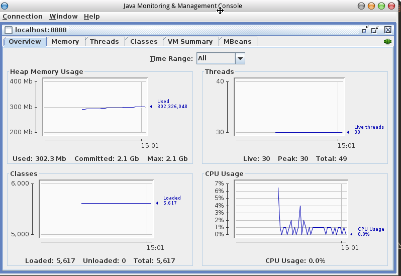

## 1 远程服务器配置

## 1.1 新建管理属性文件

> 模板文件为$JAVA_HOME/jre/lib/management/management.properties

编辑management.properties，内容如下：

```properties
com.sun.management.jmxremote.port=8888
com.sun.management.jmxremote.rmi.port=8888
com.sun.management.jmxremote.ssl=false
com.sun.management.jmxremote.authenticate=false
com.sun.management.jmxremote.local.only=false
```

> 注：

* 8888可以修改为其它可用端口号；
* 此处禁用了SSL和身份验证，存在安全隐患，若安全性要求较高，请将其配置并启用；

## 2 运行Java程序

如`$JAVA_HOME/jre/lib/management/management.properties`指出，我们需要在启动Java程序时使用属性`com.sun.management.config.file`来指定配置文件，实例启动命令如下：

```bash
$ java -Dcom.sun.management.config.file=~/management.properties -jar hello.jar
```

> 注：其中`hello.jar`为JAR文件名称示例

## 3 SSH转发

> 摘自：man ssh(1) -L port:host:hostport 
将本地机(客户机)的某个端口转发到远端指定机器的指定端口. 工作原理是这样的, 本地机器上分配了一个 socket 侦听 port 端口，一旦这个端口上有了连接, 该连接就经过安全通道转发出去, 同时远程主机和 host 的 hostport 端口建立连接. 可以在配置文件中指定端口的转发。只有 root 才能转发特权端口. IPv6 地址用另一种格式说明: port/host/hostport

假定Java程序运行于主机`192.168.0.83`上，并且该主机的`TCP端口8888`可访问，执行命令：

```bash
$ ssh user@192.168.0.83 -L 8888:192.168.0.83:8888
```

输入用户user的密码，成功登录即可。

> 注：若 Windows 用户使用PuTTY作为终端，请参考[has-anyone-ever-got-a-remote-jmx-jconsole-to-work](https://stackoverflow.com/questions/151238/has-anyone-ever-got-a-remote-jmx-jconsole-to-work)

## 4 运行Jconsole

执行命令：

```bash
$ jconsole -interval=1 localhost:8888
```

提示`Secure connection failed. Retry insecurely?`，如图：


选择`Insecure connection`，如图：



## 5 参考

- https://stackoverflow.com/questions/151238/has-anyone-ever-got-a-remote-jmx-jconsole-to-work 
- https://docs.oracle.com/javase/9/management/monitoring-and-management-using-jmx-technology.htm#JSMGM-GUID-7B962724-69BC-46AF-A46E-4A47A4E0B57A
