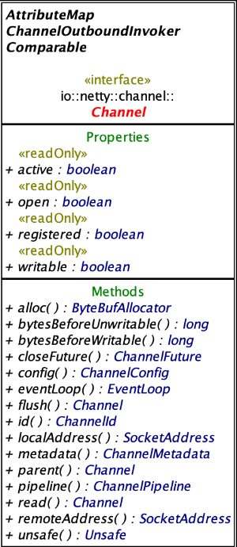

本人使用的`IntelliJ IDEA Community Edition`没有`Class Diagram`功能，在逛`stackoverflow`时，发现了工具[Class Visualizer](http://class-visualizer.net/)，通过加载Jar包的形式绘制类关系图表，在阅读开源项目源代码时能提供帮助，下图是`io.netty.channel.Channel`的关系图：

下图是其类图：

真香😋

参考：

- [Class diagrams - Help | IntelliJ IDEA - JetBrains](https://www.jetbrains.com/help/idea/class-diagram.html)
- [Sketch It! - Plugins | JetBrains](https://plugins.jetbrains.com/plugin/10387-sketch-it-)
- [Application to generate Java class hierarchy diagram](https://stackoverflow.com/questions/1168753/application-to-generate-java-class-hierarchy-diagram)